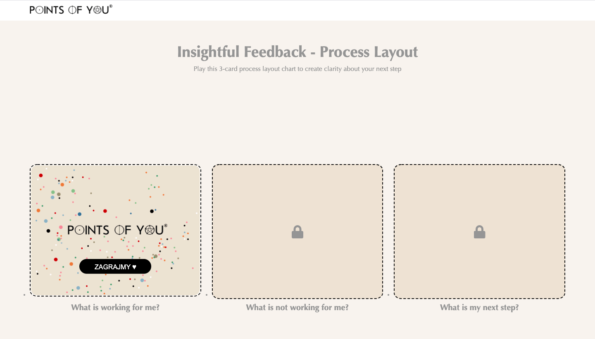
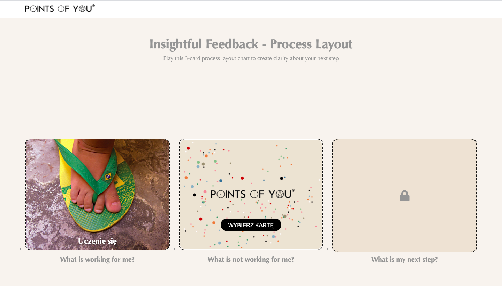
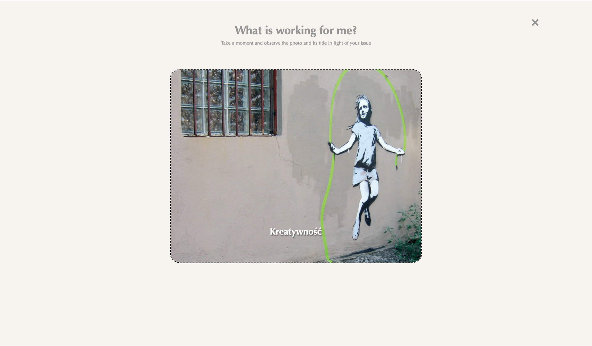

# process layout chart for Points of You@ Polska in JavaScript

Aplikacja w JavaScript dla Points of You® Polska - Digital 3-card process layout chart demo
Live Demo: https://annasawickaziolkowska.github.io/PointsOfYou-process-layout-chart/

 

